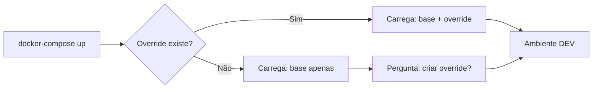
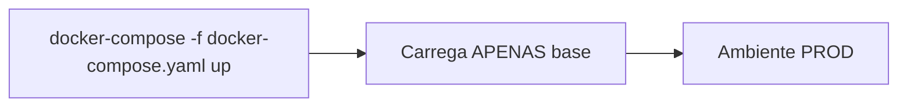

# 🎯 Ribeira Azul - Docker Environment Strategy

## 📊 Resumo da Implementação

Este documento resume a estratégia de ambientes Docker implementada para o projeto Ribeira Azul.

---

## 🏗️ Arquitetura de Arquivos

```
ribeirazul/
├── docker-compose.yaml                    # ✅ Configuração BASE (Produção)
├── docker-compose.dev.yml                 # 🔧 Override EXPLÍCITO (Dev)
├── docker-compose.override.yml            # 🚫 GIT IGNORED - Auto override (Dev)
├── docker-compose.override.yml.example    # 📝 Template do override
│
├── .env                                   # 🚫 GIT IGNORED - Vars atuais
├── .env.development                       # 📝 Template para desenvolvimento
├── .env.example                           # 📝 Template básico
├── .env.production                        # 🚫 GIT IGNORED - Vars de produção
│
├── dev-start.sh                           # 🚀 Script de início (Linux/Mac)
├── dev-start.ps1                          # 🚀 Script de início (Windows)
├── prod-start.sh                          # 🏭 Script produção (Linux/Mac)
├── prod-start.ps1                         # 🏭 Script produção (Windows)
│
└── DOCKER_SETUP.md                        # 📚 Documentação completa
```

---

## 🔄 Fluxo de Trabalho

### Desenvolvimento (Local)



**Comando**: `docker-compose up` ou `./dev-start.ps1`

**Arquivos carregados**:
1. `docker-compose.yaml` (base)
2. `docker-compose.override.yml` (se existir)

**Características**:
- ✅ NODE_ENV=development
- ✅ Portas expostas (3000, 8081, 5432, 6379, 9000, 9001)
- ✅ CORS para localhost
- ✅ Logs em debug
- ✅ Healthchecks rápidos

---

### Produção (Coolify/Deploy)



**Comando**: `docker-compose -f docker-compose.yaml up` ou `./prod-start.ps1`

**Arquivos carregados**:
1. `docker-compose.yaml` (base APENAS)

**Características**:
- ✅ NODE_ENV=production
- ✅ Portas NÃO expostas (apenas rede interna)
- ✅ CORS para domínios reais
- ✅ Logs em warn
- ✅ Healthchecks robustos
- ✅ Restart policies
- ✅ Labels Coolify/Traefik

---

## 🎨 Estratégia de Override

### Por que usar Override Pattern?

| Vantagem | Descrição |
|----------|-----------|
| **Sem duplicação** | Um único `docker-compose.yaml` base |
| **Seguro** | Produção não afetada por mudanças locais |
| **Flexível** | Override automático ou explícito |
| **Padrão** | Prática recomendada pelo Docker |
| **Simples** | Fácil alternância entre ambientes |

### Opções de Override

#### 1. Override Automático (Recomendado para Dev)
```bash
# Cria override local
cp docker-compose.override.yml.example docker-compose.override.yml

# Inicia automaticamente com override
docker-compose up
```

#### 2. Override Explícito
```bash
# Usa override específico
docker-compose -f docker-compose.yaml -f docker-compose.dev.yml up
```

#### 3. Sem Override (Produção)
```bash
# Usa APENAS base
docker-compose -f docker-compose.yaml up
```

---

## 🔧 Configurações por Ambiente

### Desenvolvimento

| Variável | Valor | Notas |
|----------|-------|-------|
| NODE_ENV | development | Habilita debug |
| LOG_LEVEL | debug | Logs detalhados |
| CORS_ORIGINS | http://localhost:3000,... | Múltiplos localhosts |
| API_URL | http://localhost:3000 | URL local |
| Portas | Expostas | Acesso externo |

### Produção

| Variável | Valor | Notas |
|----------|-------|-------|
| NODE_ENV | production | Otimizações ativas |
| LOG_LEVEL | warn | Apenas warnings/erros |
| CORS_ORIGINS | https://neodras.com,... | Domínios reais |
| API_URL | https://www.neodras.com | URL pública |
| Portas | Não expostas | Apenas rede interna |

---

## 🚀 Comandos Rápidos

### Desenvolvimento

```bash
# Início rápido (Windows)
.\dev-start.ps1

# Início rápido (Linux/Mac)
./dev-start.sh

# Manual
docker-compose up -d
docker-compose logs -f
```

### Produção

```bash
# Início rápido (Windows)
.\prod-start.ps1

# Início rápido (Linux/Mac)
./prod-start.sh

# Manual
docker-compose -f docker-compose.yaml up -d
docker-compose -f docker-compose.yaml logs -f
```

---

## 📝 Checklist de Setup

### Primeira Vez (Desenvolvimento)

- [ ] Copiar `.env.development` para `.env`
- [ ] Copiar `docker-compose.override.yml.example` para `docker-compose.override.yml`
- [ ] Ajustar variáveis no `.env` se necessário
- [ ] Executar `./dev-start.ps1` (Windows) ou `./dev-start.sh` (Linux/Mac)
- [ ] Acessar http://localhost:3000

### Deploy em Produção

- [ ] Configurar `.env` com valores de produção
- [ ] **REMOVER** `docker-compose.override.yml` se existir
- [ ] Verificar `NODE_ENV=production` no `.env`
- [ ] Verificar CORS apontando para domínio real
- [ ] Executar `docker-compose -f docker-compose.yaml up -d`
- [ ] Verificar logs: `docker-compose -f docker-compose.yaml logs -f`

---

## 🔍 Verificação

### Como verificar qual configuração está ativa?

```bash
# Ver configuração final (merged)
docker-compose config

# Verificar variáveis de ambiente de um serviço
docker-compose exec auth env | grep NODE_ENV
docker-compose exec auth env | grep CORS

# Ver portas expostas
docker-compose ps
```

---

## 🎓 Melhores Práticas

### ✅ FAZER

- ✅ Usar `docker-compose up` em desenvolvimento
- ✅ Usar `docker-compose -f docker-compose.yaml up` em produção
- ✅ Manter `docker-compose.override.yml` no `.gitignore`
- ✅ Atualizar `.example` files ao mudar configurações
- ✅ Testar em ambos ambientes antes de commitar

### ❌ NÃO FAZER

- ❌ Commitar `docker-compose.override.yml`
- ❌ Commitar `.env` com credenciais reais
- ❌ Usar override em produção
- ❌ Hardcodar valores sensíveis

---

## 🆘 Ajuda Rápida

**Problema**: Container não inicia
```bash
docker-compose logs -f [service-name]
```

**Problema**: CORS error
```bash
# Verificar CORS no .env
cat .env | grep CORS

# Reiniciar serviços
docker-compose restart
```

**Problema**: Override não funciona
```bash
# Ver configuração final
docker-compose config

# Rebuild completo
docker-compose down
docker-compose build --no-cache
docker-compose up -d
```

---

## 📚 Documentação Adicional

- Ver [DOCKER_SETUP.md](./DOCKER_SETUP.md) para guia completo
- Ver [README.md](./README.md) para documentação do projeto
- Ver [.env.development](./.env.development) para variáveis de exemplo

---

## 🎉 Conclusão

A implementação do **Docker Compose Override Pattern** permite:

✅ **Desenvolvimento ágil** com hot reload e debug  
✅ **Produção segura** sem interferência de configs locais  
✅ **Fácil manutenção** com separação clara de ambientes  
✅ **Sem breaking changes** na configuração atual  

**Desenvolvido por**: Dev Sênior com 15+ anos de experiência  
**Data**: 2025-12-02  
**Versão**: 1.0.0
