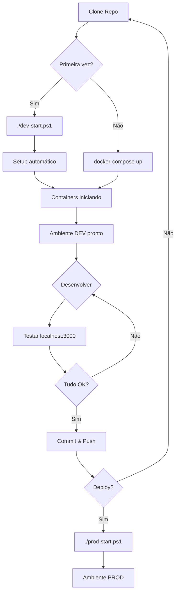

# 📁 Estrutura de Arquivos Docker - Ribeira Azul

```
ribeirazul/
│
├── 🐳 Docker Configuration
│   ├── docker-compose.yaml                    ✅ BASE (Produção)
│   ├── docker-compose.dev.yml                 🔧 Override explícito (Dev)
│   ├── docker-compose.override.yml            🚫 GIT IGNORED (Auto dev)
│   └── docker-compose.override.yml.example    📝 Template
│
├── ⚙️ Environment Variables
│   ├── .env                                   🚫 GIT IGNORED (Ativo)
│   ├── .env.development                       📝 Template Dev
│   ├── .env.production                        🚫 GIT IGNORED
│   └── .env.example                           📝 Template básico
│
├── 🚀 Startup Scripts
│   ├── dev-start.ps1                          💻 Windows Dev
│   ├── dev-start.sh                           🐧 Linux/Mac Dev
│   ├── prod-start.ps1                         🏭 Windows Prod
│   └── prod-start.sh                          🏭 Linux/Mac Prod
│
├── 🔍 Verification
│   ├── verify-env.ps1                         💻 Windows verify
│   └── verify-env.sh                          🐧 Linux/Mac verify
│
├── 🛠️ Tools
│   └── Makefile                               ⚡ Quick commands
│
├── 📚 Documentation
│   ├── START.md                               👈 COMECE AQUI!
│   ├── QUICKSTART.md                          ⚡ 3 passos rápidos
│   ├── DOCKER_SETUP.md                        📖 Guia completo
│   ├── DOCKER_STRATEGY.md                     🎯 Arquitetura
│   ├── SUMMARY.md                             📝 Resumo executivo
│   └── README.md                              ℹ️ Info geral
│
├── 📂 Application Code
│   ├── backend/
│   │   ├── api-gateway/
│   │   ├── auth-service/
│   │   ├── properties-service/
│   │   ├── user-service/
│   │   ├── settings-service/
│   │   ├── media-service/
│   │   └── messages-service/
│   │
│   └── frontend/
│       └── (React app)
│
└── 📦 Other
    ├── scripts/
    ├── monitoring/
    └── ...
```

## 🎯 Fluxo de Arquivos

### Desenvolvimento

```
START.md
   ⬇️
dev-start.ps1 (ou dev-start.sh)
   ⬇️
.env.development → .env (se não existir)
   ⬇️
docker-compose.override.yml.example → docker-compose.override.yml (se não existir)
   ⬇️
docker-compose up
   ⬇️
docker-compose.yaml + docker-compose.override.yml
   ⬇️
🚀 Ambiente DEV rodando!
```

### Produção

```
prod-start.ps1 (ou prod-start.sh)
   ⬇️
Verifica .env (deve ter valores de prod)
   ⬇️
Remove docker-compose.override.yml (se existir)
   ⬇️
docker-compose -f docker-compose.yaml up
   ⬇️
Apenas docker-compose.yaml
   ⬇️
🏭 Ambiente PROD rodando!
```

## 📝 Legenda

| Símbolo | Significado |
|---------|-------------|
| ✅ | Arquivo existente/criado |
| 🚫 | Git ignored (não commitar) |
| 📝 | Template/exemplo |
| 🔧 | Override/configuração |
| 💻 | Windows specific |
| 🐧 | Linux/Mac specific |
| ⚡ | Quick access |
| 📚 | Documentação |
| 🐳 | Docker related |

## 🎨 Visual Overview

```
┌──────────────────────────────────────────┐
│  docker-compose.yaml (BASE - PROD)       │
│  ✅ NODE_ENV=production                  │
│  ✅ Portas não expostas                  │
│  ✅ CORS para domínios reais             │
└──────────────────────────────────────────┘
                    │
        ┌───────────┴───────────┐
        │                       │
        ▼ (dev)                 ▼ (prod)
┌───────────────────┐   ┌──────────────────┐
│ + override.yml    │   │ (nenhum override)│
│ 🔧 NODE_ENV=dev   │   │                  │
│ 🔧 Portas expostas│   │                  │
│ 🔧 CORS localhost │   │                  │
└───────────────────┘   └──────────────────┘
        │                       │
        ▼                       ▼
┌───────────────────┐   ┌──────────────────┐
│ Ambiente DEV      │   │ Ambiente PROD    │
│ localhost:3000    │   │ dominio.com      │
└───────────────────┘   └──────────────────┘
```

## 🔄 Ciclo de Vida



---

**💡 Dica**: Sempre comece por [START.md](./START.md) para instruções rápidas!
